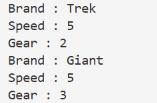
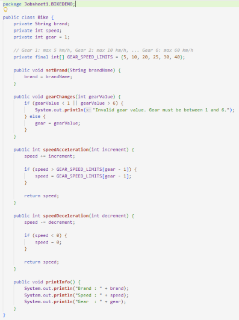
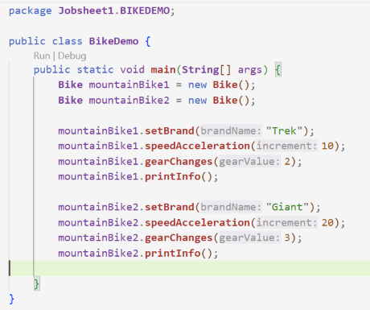
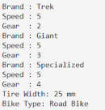
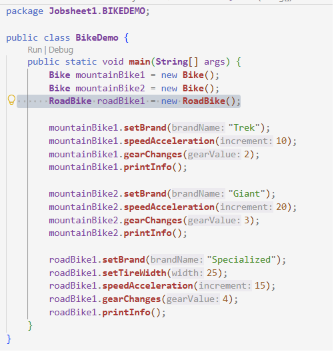
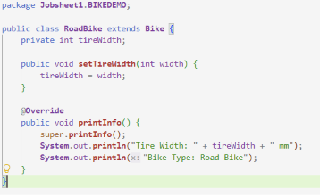
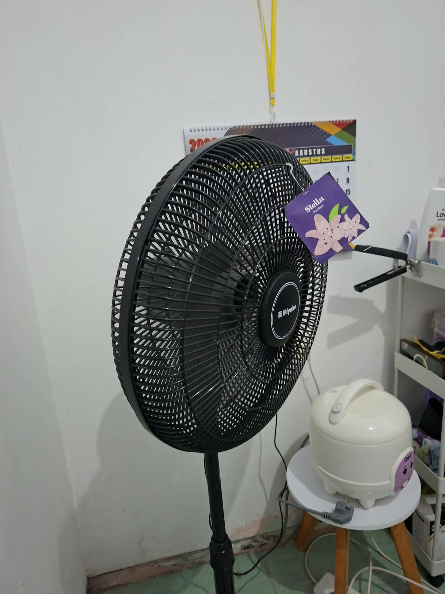
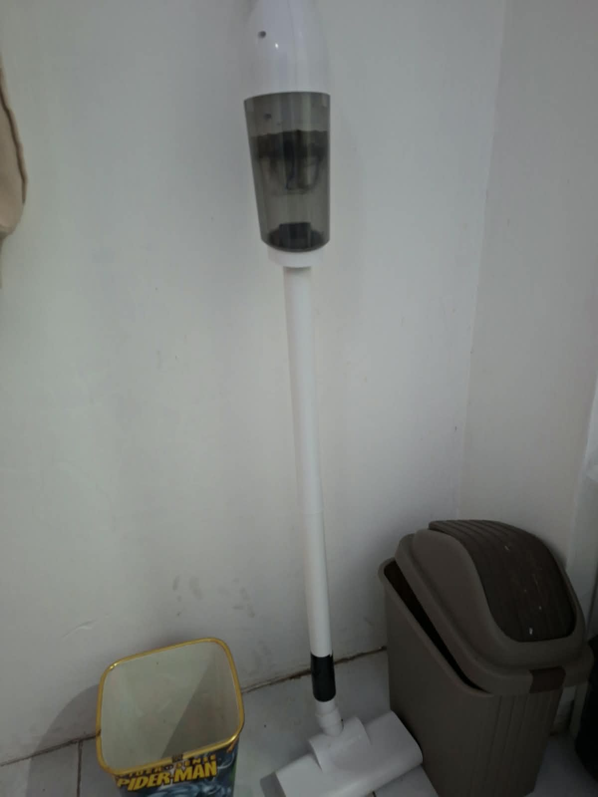
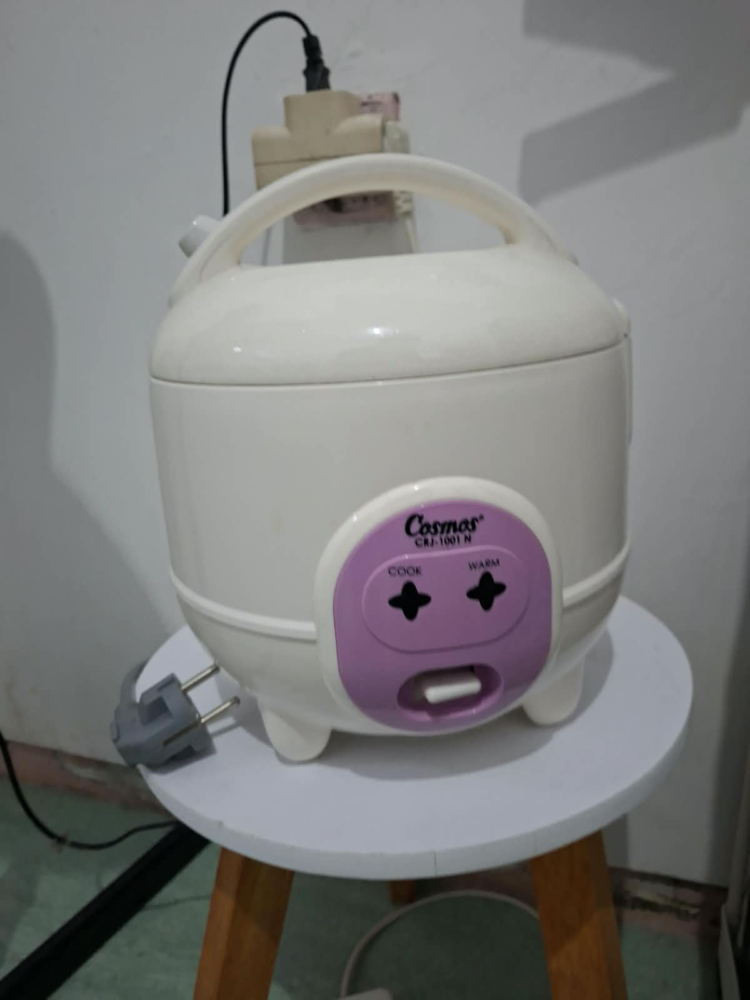

| | Praktikum Pemrograman Berbasis Objek |
|---|---|
| NIM | 254107020065 |
| Nama | Mayla Ayu Kirana Nathaniela |
| Kelas | TI 2G |
| Repository | https://github.com/maylakirana2605-ui/PraktikumPBO|

# Jobsheet 1 - Pengantar Konsep Pemrograman Berorientasi Objek

## Percobaan 1

Solusi diimplementasikan pada file [Bike.java](BIKEDEMO/Bike.java) dan [BikeDemo.java](BIKEDEMO/BikeDemo.java), berikut adalah hasil tangkapan hasil program:

screenshot kode program

## Percobaan 2

Solusi diimplementasikan pada file [Bike.java](BIKEDEMO/Bike.java) dan [BikeDemo.java](BIKEDEMO/BikeDemo.java), [RoadBike.java](BIKEDEMO/RoadBike.java)berikut adalah hasil tangkapan layar program:

screenshot kode program

### Pertanyaan
1. Jelaskan perbedaan antara object dengan class!
2. Jelaskan alasan gear dan brand dapat menjadi atribut dari object Bike!
3. Sebutkan salah satu kelebihan utama dari pemrograman berorientasi objek dibandingkan
dengan pemrograman prosedural!
4. Apakah diperbolehkan melakukan pendefinisian dua buah atribut dalam satu baris kode seperti
“public String nama, alamat;”?
5. Pada class RoadBike, jelaskan alasan atribut brand, speed, dan gear tidak lagi ditulis di dalam
class tersebut! 

### Jawaban
1. Class adalah cetak biru (blueprint) atau kerangka dasar yang mendefinisikan karakteristik (state) dan perilaku (behaviour) dari suatu entitas, sedangkan object adalah bentuk konkret (hasil instansiasi) dari class yang memiliki data atau nilai spesifik di dalam memori.
2. gear dan brand merepresentasikan kondisi (state), ciri-ciri, serta data spesifikasi yang melekat pada fisik sepeda di dunia nyata, sehingga dimodelkan sebagai variabel penyimpan data (atribut) di dalam class Bike.
3. Program bersifat lebih modular dan fleksibel. Jika terjadi penambahan fitur baru atau perubahan pada satu komponen, kode bagian lain tidak akan mudah terganggu karena data dan fungsinya telah terbungkus rapi di dalam objek masing-masing.
4. Diperbolehkan. Sintaks Java mengizinkan deklarasi beberapa variabel bertipe data sama dalam satu baris menggunakan pemisah tanda koma (,), meskipun penulisan baris terpisah biasanya lebih disarankan untuk keterbacaan kode.
5. Class RoadBike merupakan kelas turunan yang melakukan pewarisan (extends) dari class Bike. Melalui mekanisme inheritance, seluruh atribut (brand, speed, gear) serta method milik superclass (Bike) otomatis diturunkan dan dapat langsung digunakan oleh class RoadBike tanpa harus dideklarasikan ulang.

## Tugas Praktikum

foto 4 objek yang ada di sekitar

Solusi tugas praktikum diimplementasikan pada file [VacuumCleaner.java](TugasPrak/VacuumCleaner.java), [RiceCooker.java](TugasPrak/RiceCooker.java), [Fan.java](TugasPrak/Fan.java), [Gadget.java](TugasPrak/Gadget.java), [Smartphone.java](TugasPrak/Smartphone.java), [Laptop.java](TugasPrak/Laptop.java), dan [MainDemo.java](TugasPrak/MainDemo.java).

Berikut adalah tangkapan layar hasil eksekusi program:

