| | Praktikum Pemrograman Berbasis Objek |
|---|---|
| NIM | 254107020065 |
| Nama | Mayla Ayu Kirana Nathaniela |
| Kelas | TI 2G |
| Repository | https://github.com/maylakirana2605-ui/PraktikumPBO|

# Jobsheet 3: Enkapsulasi Pada Pemrograman Berorientasi Objek 

## Percobaan 1 - Enkapsulasi

Solusi diimplementasikan pada file [Motor.java](../MotorEncapsulation/Motor.java) dan [MotorDemo.java](../MotorEncapsulation/motorDemo.java). Berikut adalah hasil tangkapan layar output saat program dijalankan:

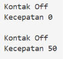

screenshot kode program

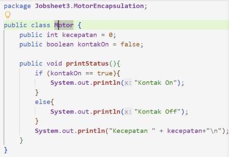
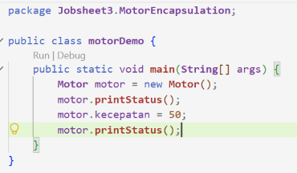

Program terasa aneh karena motor bisa langsung berjalan 50 padahal kuncinya masih mati (OFF). Hal ini bisa terjadi karena variabelnya diset `public`, jadi siapa saja dari luar bisa mengubah nilainya sembarangan tanpa dicek dulu.

Solusinya adalah mengubah status variabel `kecepatan` dan `kontakOn` menjadi `private` supaya tersembunyi dan tidak bisa diedit langsung dari luar. Perubahan nilai nantinya hanya bisa lewat fungsi khusus seperti `nyalakanMesin()` dan `tambahKecepatan()`, jadi kecepatan baru bisa bertambah kalau posisi kuncinya sudah benar-benar menyala.

## Percobaan 2 -  Access Modifier

Solusi diimplementasikan pada file [Motor.java](../MotorEncapsulation/Motor.java) dan [MotorDemo.java](../MotorEncapsulation/motorDemo.java). Berikut adalah hasil tangkapan layar output saat program dijalankan:

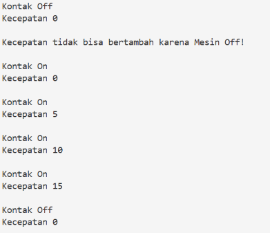

screenshot kode program

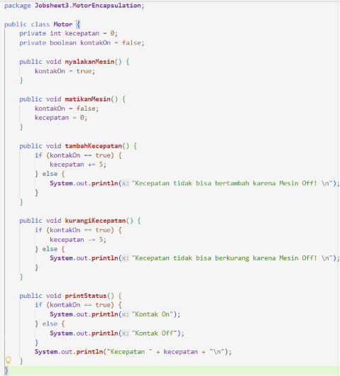
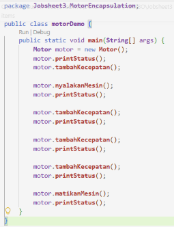

## Pertanyaan

#### 1. Pada class TestMobil, saat kita menambah kecepatan untuk pertama kalinya, mengapa muncul peringat
Peringatan tersebut muncul karena nilai awal dari atribut kontakOn masih false atau mesin dalam keadaan mati. Di dalam method tambahKecepatan(), penambahan nilai kecepatan hanya akan dijalankan jika kontakOn == true. Karena syarat tersebut tidak terpenuhi, program langsung mengeksekusi blok else yang mencetak pesan peringatan tersebut.
#### 2. Mengapa atribut kecepatan dan kontakOn diset private? 
Atribut kecepatan dan kontakOn diset private untuk menerapkan prinsip enkapsulasi (information-hiding). Hal ini bertujuan agar data di dalam objek tidak bisa diakses atau diubah secara sembarangan dari luar kelas, melainkan harus melewati method perantara yang memiliki aturan dan validasi tertentu
#### 3. Ubah class Motor sehingga kecepatan maksimalnya adalah 100!
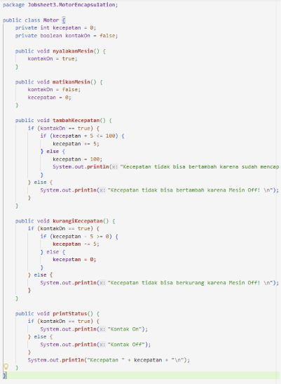
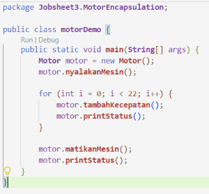

output program:

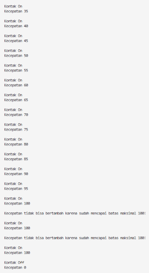

## Percobaan 3 - Getter dan Setter 

Solusi diimplementasikan pada file [Anggota.java](../KoperasiGetterSetter/Anggota.java) dan [KoperasiDemo.java](../KoperasiGetterSetter/KoperasiDemo.java). Berikut adalah hasil tangkapan layar output saat program dijalankan:

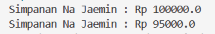

screenshot kode program

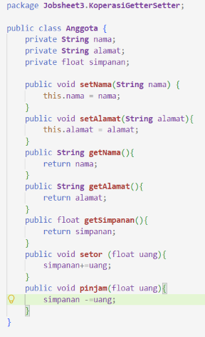
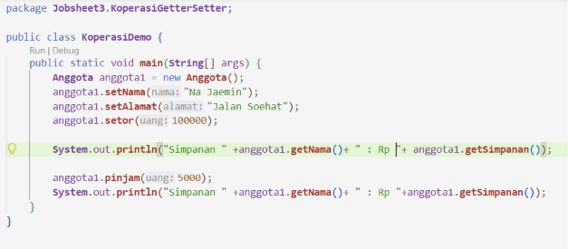

## Percobaan 4 - Konstruktor, Instansiasi  

Solusi diimplementasikan pada file [Anggota.java](../KoperasiGetterSetter/Anggota.java) dan [KoperasiDemo.java](../KoperasiGetterSetter/KoperasiDemo.java). Berikut adalah hasil tangkapan layar output saat program dijalankan:

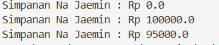

### Pertanyaan

1. Apa yang dimaksud getter dan setter?
2. Apa kegunaan dari method getSimpanan()?
3. Method apa yang digunakan untuk menambah saldo?
4. Apa yang dimaksud konstruktor?
5. Sebutkan aturan dalam membuat konstruktor?
6. Apakah boleh konstruktor bertipe private?
7. Kapan menggunakan konstruktor dengan passing parameter?
8. Apa perbedaan inisialisasi atribut dan instansiasi atribut?
9. Apa perbedaan inisialisasi method dan instansiasi method? 

### Jawaban

1. Getter adalah fungsi publik yang mengembalikan nilai dari variabel private untuk dibaca oleh class lain, sedangkan setter adalah fungsi publik bertipe void yang bertugas mengubah atau mengisi nilai variabel private tersebut.
2. Method getSimpanan() digunakan untuk membaca dan menampilkan nilai saldo simpanan milik anggota koperasi tanpa memberikan akses modifikasi secara langsung ke variabel aslinya.
3. Method yang digunakan untuk menambah saldo adalah method setor.
4. Konstruktor adalah fungsi khusus di dalam class yang namanya persis sama dengan nama class tersebut dan akan otomatis dijalankan setiap kali sebuah objek baru dibuat dengan kata kunci new.
5. Aturan dalam membuat konstruktor adalah namanya harus sama persis dengan nama class, tidak boleh memiliki tipe return apa pun bahkan void, serta tidak boleh menggunakan kata kunci abstract, static, final, maupun synchronized.
6. Boleh, konstruktor bertipe private biasanya digunakan saat kita ingin membatasi pembuatan objek dari luar class, seperti pada implementasi Singleton Pattern agar objek yang dibuat hanya ada satu di memori atau pada utility class.
7. Konstruktor dengan parameter digunakan ketika sebuah objek membutuhkan data awal yang wajib ada dan spesifik sejak pertama kali dibuat, seperti nama dan alamat anggota.
8. Inisialisasi atribut adalah proses pemberian nilai pertama ke dalam suatu variabel, sedangkan instansiasi atribut adalah proses alokasi memori untuk membuat objek nyata dari tipe referensi atau class.
9. Inisialisasi method adalah tahap penulisan logika dan blok kode dari suatu method di dalam class, sedangkan instansiasi method adalah proses pemanggilan method tersebut melalui objek yang sudah aktif dibuat di memori.

## Tugas

#### 1. Cobalah program dibawah ini dan tuliskan hasil outputnya

Kode Program:

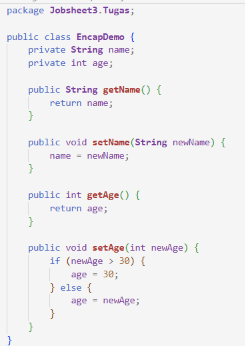
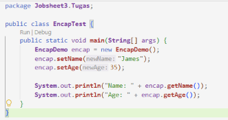

Output:

#### 2. Pada program diatas, pada class EncapTest kita mengeset age dengan nilai 35, namun pada saat ditampilkan ke layar nilainya 30, jelaskan mengapa.

Nilai age yang keluar bernilai 30 karena pada method setAge(int newAge) terdapat percabangan if (newAge > 30). Karena nilai argumen yang dimasukkan adalah 35 dan 35 bernilai lebih besar dari 30, maka blok percabangan tersebut berjalan dan mengeksekusi perintah age = 30;. Sehingga nilai umur yang disimpan di dalam variabel objek otomatis dipatok ke batas maksimalnya, yaitu 30.

#### 3. Ubah program diatas agar atribut age dapat diberi nilai maksimal 30 dan minimal 18

Kode Program:

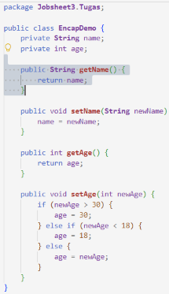

Output:

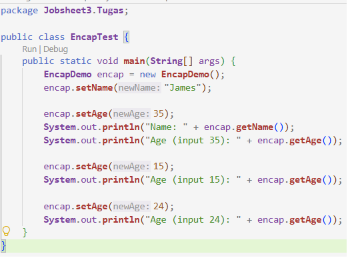

#### 4. Membuat class Kontainer dengan atribut nomorResi, namaPemilik, kapasitasMaksimal, dan beratMuatanSaatIni, serta mengujinya dengan driver class TestLogistik

Kode Program:

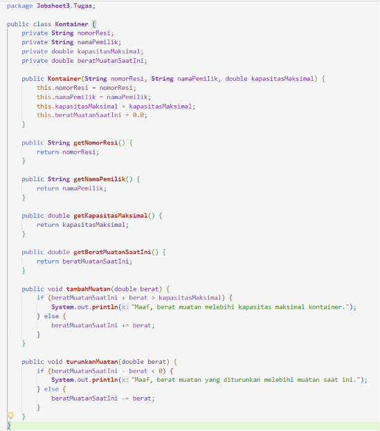
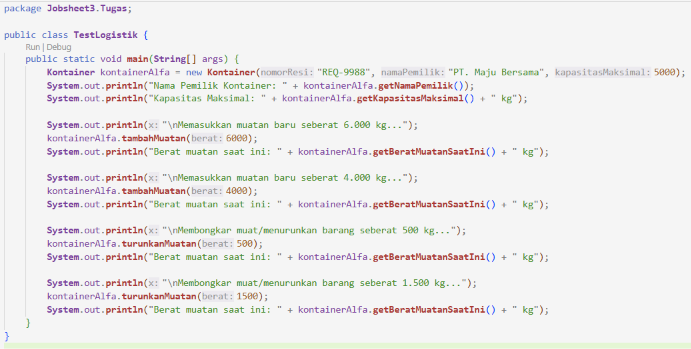

Output:

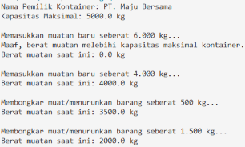

#### 5. Modifikasi method turunkanMuatan() agar penurunan muatan satu kali jalan maksimal hanya boleh 50% dari muatan saat ini.

Kode Program:

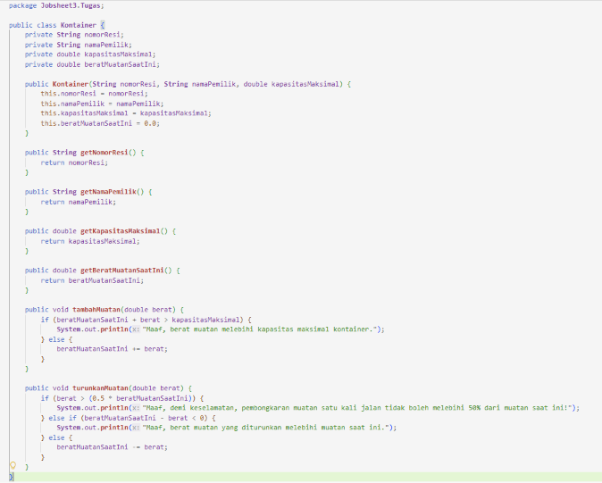

Output:

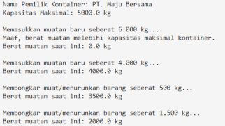

#### 6. Modifikasi class TestLogistik agar nilai penambahan dan penurunan muatan diinput secara dinamis lewat terminal menggunakan java.util.Scanner.

Kode Program:

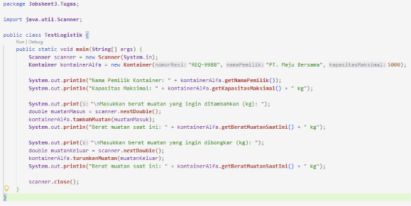

Output:

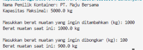

#### 7. Membuat class Tiket dengan aturan validasi harga negatif menjadi Rp 35.000 dan status pembayaran bersifat read-only melalui method lakukanPembayaran().

Kode Program:

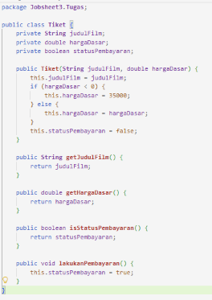
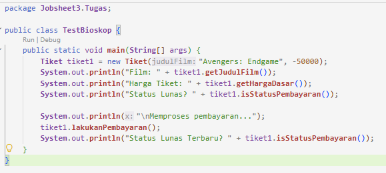

Output:

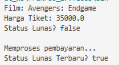

