| | Praktikum Pemrograman Berbasis Objek |
|---|---|
| NIM | 254107020065 |
| Nama | Mayla Ayu Kirana Nathaniela |
| Kelas | TI 2G |
| Repository | https://github.com/maylakirana2605-ui/PraktikumPBO|

# Jobsheet Praktikum 4: Relasi Kelas: Aggregation, Composition, dan Dependency

## Percobaan 1: Aggregation Satu-ke-Satu (Laptop dan Processor)

##### Kode:

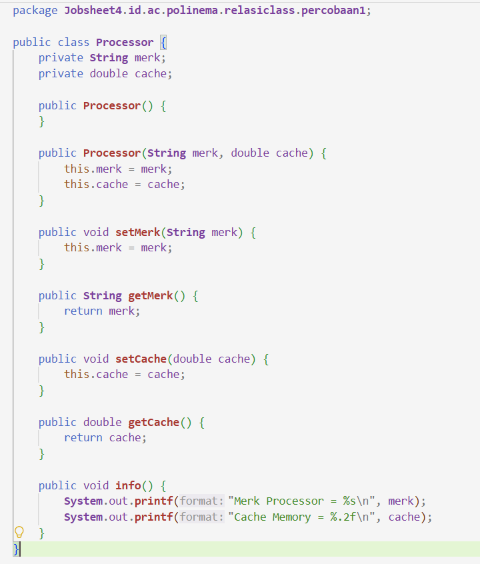
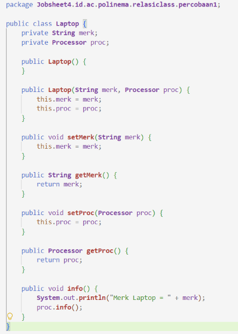

##### Output:

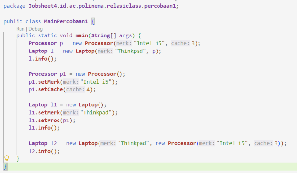

### Pertanyaan

#### 1. Di dalam class Processor dan class Laptop, terdapat method setter dan getter untuk masingmasing atributnya. Apakah gunanya method setter dan getter tersebut?  
Setter: untuk mengubah nilai atribut private dari luar class. Karena atribut dideklarasikan private, kode di luar class tidak bisa langsung menulis laptop.merk = "...".  Getter: untuk membaca nilai atribut dari luar class tanpa harus membuka akses langsung ke field-nya.  Setter dan Getter disini berperan untuk enkapsulasi, agar bisa mengakses dan mengubah atribut private dari luar class dengan aman.  
#### 2. Di dalam class Processor dan class Laptop, masing-masing terdapat konstruktor default dan konstruktor berparameter. Bagaimanakah beda penggunaan dari kedua jenis konstruktor tersebut?  
Konstruktor default:  membuat objek tanpa nilai awal (diisi lewat setter). Konstruktor berparameter: membuat objek langsung dengan nilai awal. Contoh Penggunaan :  
1. Default: Processor p1 = new Processor(); p1.setMerk("Intel i5"); p1.setCache(4); 
2. Berparameter: Processor p = new Processor("Intel i5", 3); 
#### 3.  Perhatikan class Laptop, di antara 2 atribut yang dimiliki (merk dan proc), atribut manakah yang bertipe object? Baris kode manakah yang menunjukkan bahwa class Laptop memiliki relasi dengan class Processor?  

Atribut bertipe object adalah proc (Processor).  
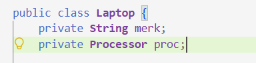

Baris ini menyatakan "Laptop memiliki Processor". Tipe datanya bukan String atau int, tapi class Processor, artinya field ini menyimpan referensi ke objek Processor yang terpisah. 

#### 4. Perhatikan pada class Laptop, apakah guna dari sintaks proc.info()? 
proc.info() adalah delegasi (delegation). Laptop tidak tahu bagaimana cara mencetak detail Processor (merk, cache. Jadi Laptop.info() cukup memanggil proc.info() dan membiarkan objek Processor mencetak dirinya sendiri.
#### 5. KPada Langkah 8, objek p dibuat lebih dulu baru diberikan ke constructor Laptop. Pada Langkah 10, objek Processor dibuat langsung di dalam argumen constructor Laptop (tanpa variabel p). Apakah keduanya menghasilkan output yang berbeda? Mengapa? 
Output sama, karena yang menentukan relasi Aggregation bukan letak penulisan  new Processor(). Tapi ditentukan dari siapa yang memanggil new.  Pada kedua langkah, yang membuat objek Processor adalah kode di MainPercobaan1 (bukan kode di dalam class Laptop). 

Langkah 8: Processor p = new Processor(...); Laptop l = new Laptop("Thinkpad", p); Langkah 10: Laptop l2 = new Laptop("Thinkpad", new Processor(...)); Keduanya identik: Processor dibuat di luar Laptop, lalu referensinya diteruskan ke Laptop. 
#### 6. Secara kode, apakah relasi Laptop-Processor pada percobaan ini termasuk Aggregation atau Composition? Tunjukkan baris kode yang menjadi bukti jawabanmu.  

Relasi Aggregation. 
1. Laptop.java : new processor tidak pernah dipanggil 

2. MainPercobaan1.java :  Proccessor p 

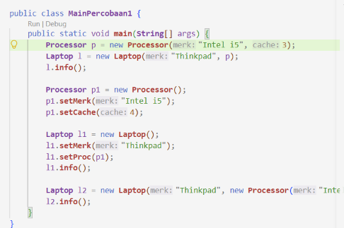

Processor dibuat di luar class Laptop, lalu di-inject lewat constructor (new Laptop("Thinkpad", p)) atau setter (l1.setProc(p1)). 

#### 7. Andaikan constructor Laptop diubah menjadi seperti berikut, sehingga Processor dibuat sendiri di dalam Laptop, bukan diterima sebagai parameter: public Laptop (String merk) { this.merk = merk; this.proc = new Processor ("Generic", 1); } Apakah relasi Laptop-Processor pada versi ini masih Aggregation? Jelaskan alasannya (jawaban ini akan kita buktikan sendiri lewat kode pada Percobaan 5). 
Bukan Agregation, relasi berubah menjadi Composition, karena Laptop sendiri yang memanggil new Processor() di dalam constructor-nya. Processor tidak bisa berdiri sendiri tanpa Laptop.

## Percobaan 2: Aggregation dengan Relasi Ganda (Rental Mobil)

##### Kode:

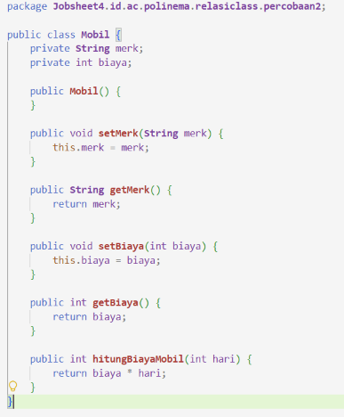
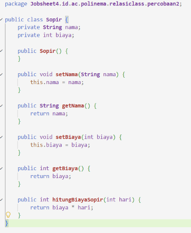
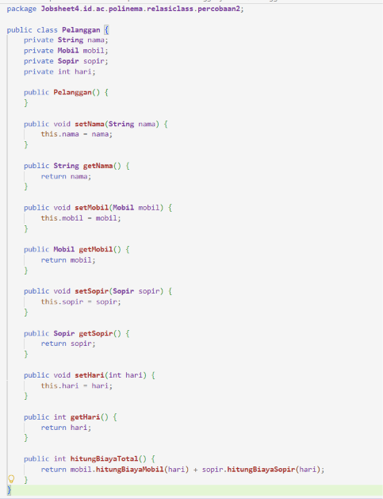
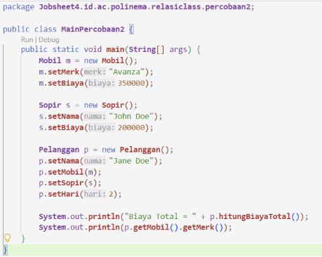

##### Output:

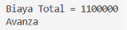

### Pertanyaan

#### 1. Perhatikan class Pelanggan. Pada baris program manakah yang menunjukkan bahwa class Pelanggan memiliki relasi dengan class Mobil dan class Sopir?  

Mobil & Sopir bertipe object , menunjukkan Pelanggan memiliki 
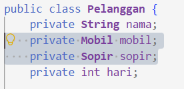

#### 2. Perhatikan method hitungBiayaSopir pada class Sopir, serta method hitungBiayaMobil pada class Mobil. Mengapa method tersebut harus memiliki argument hari, padahal hari sendiri adalah atribut milik Pelanggan, bukan milik Mobil atau Sopir?  

Karena method tersebut berada di class Mobil/Sopir, sedangkan atribut hari tidak ada di class mereka. Mobil tidak tahu berapa hari dia disewa; Sopir juga tidak tahu berapa hari dia bekerja. Yang tahu adalah Pelanggan. Jika hari disimpan sebagai atribut Mobil, maka satu objek Mobil hanya bisa dipakai untuk satu transaksi. 

#### 3. Perhatikan kode dari class Pelanggan. Untuk apakah perintah mobil.hitungBiayaMobil(hari) dan sopir.hitungBiayaSopir(hari)?  

1. mobil.hitungBiayaMobil(hari)  memanggil method milik objek mobil (yang dipegang Pelanggan) untuk menghitung biaya sewa mobil selama hari. 
2. sopir.hitungBiayaSopir(hari)  memanggil method milik objek sopir untuk menghitung biaya sopir selama hari. 

Hasil keduanya lalu dijumlahkan oleh Pelanggan.hitungBiayaTotal() 

#### 4.  Perhatikan class MainPercobaan2. Untuk apakah sintaks p.setMobil(m) dan p.setSopir(s)? 

Keduanya adalah setter injection: memasukkan referensi objek Mobil (m) dan objek Sopir (s) yang sudah dibuat di luar class, ke dalam atribut Pelanggan (p.mobil dan p.sopir). Tanpa pemanggilan ini, atribut mobil dan sopir di dalam Pelanggan tetap null. 

#### 5. Untuk apakah proses p.hitungBiayaTotal()?  

Untuk menyatukan perhitungan dari dua bagian yaitu mobil.hitungBiayaMobil(hari) + sopir.hitungBiayaSopir(hari)

#### 6. Pada Langkah 7, p.getMobil().getMerk() memanggil dua method sekaligus secara berantai. Jelaskan urutan eksekusinya: objek apa yang dikembalikan p.getMobil(), dan objek apa yang kemudian dipanggil .getMerk()-nya?

1. p.getMobil() dipanggil lebih dulu.  Method ini mengembalikan objek Mobil yang disimpan di field mobil milik Pelanggan. Jadi hasil sementara adalah sebuah referensi Mobil. 
2. getMerk() dipanggil pada objek Mobil hasil langkah 1.  Method ini mengembalikan String berisi merk mobil (misal "Avanza").

#### 7. Andaikan p.setMobil(m) tidak pernah dipanggil lalu p.hitungBiayaTotal() dijalankan, error apa yang akan muncul? Jelaskan mengapa error itu terjadi, dikaitkan dengan konsep referensi objek yang sudah kita pelajari sebelumnya.

Akan muncul NullPointerException pada baris: return mobil.hitungBiayaMobil(hari) + ... 

Karena p.mobil masih null, saat mobil.hitungBiayaMobil(hari) dipanggil, terjadi akses method pada referensi null.

## Percobaan 3: Aggregation dengan Dua Role ke Kelas yang Sama (Kereta Api)

##### Kode:

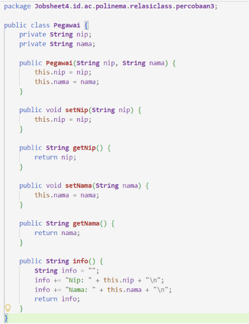
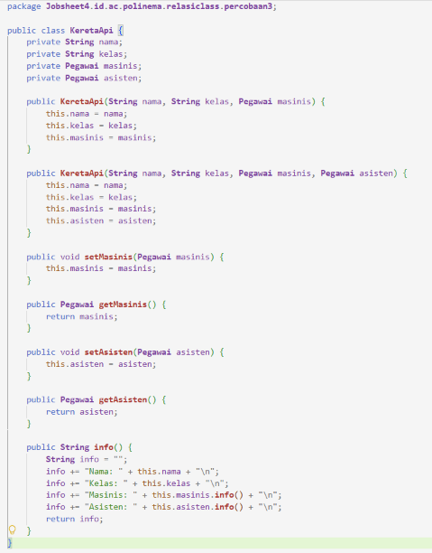
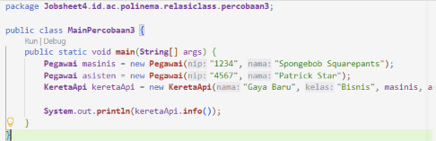

##### Output:

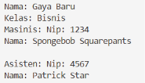

##### Class Main Pertanyaan:

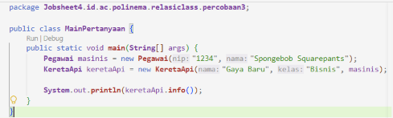

##### Output:

Terjadi error null pointer

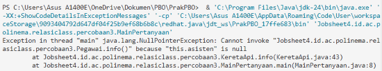

##### Modifikasi: 

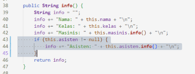

##### Output:

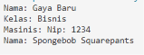

### Pertanyaan

#### 1. Di dalam method info() pada class KeretaApi, baris this.masinis.info() dan this.asisten.info() digunakan untuk apa?  

this.masinis.info()  meminta objek Pegawai yang berperan sebagai masinis untuk mencetak info dirinya (NIP + nama), lalu hasil string-nya digabungkan ke info milik KeretaApi. 

this.asisten.info() meminta objek Pegawai yang berperan sebagai asisten. 

KeretaApi tidak menyimpan NIP/nama secara langsung, dia hanya memegang referensi Pegawai dan menyuruhnya mencetak diri sendiri.  

#### 2. Apa hasil output dari MainPertanyaan sebelum diperbaiki (Langkah 8)? Mengapa hal tersebut dapat terjadi?  

Terjadi error null pointer, karena :  
1.  MainPertanyaan memakai constructor 3 paramer 
2. Field asisten tidak diberi nilai apa pun, sehingga secara default bernilai null. 
3. Saat info() dipanggil, kode tetap mengeksekusi this.asisten.info() 

Java tidak bisa "memanggil method pada kekosongan", sehingga error dan menghentikan program. 

#### 3. Kaitkan dengan materi referensi objek: apa isi variabel asisten di dalam objek KeretaApi yang dibuat lewat constructor 3-parameter, sebelum guard clause ditambahkan?

Isinya adalah null (referensi kosong) tidak menunjuk ke objek Pegawai mana pun. Karena constructor 3 parameter tidak punya baris this.asisten, maka atribut asisten tetap pada nilai default Java untuk tipe referensi, yaitu null.  

#### 4. Setelah guard clause ditambahkan (Langkah 9), apakah objek masinis juga perlu dicek dengan cara yang sama? Perhatikan kedua constructor KeretaApi, apakah mungkin masinis bernilai null? Jelaskan. 

Tidak perlu, karena Kedua constructor sama-sama menerima parameter masinis dan langsung mengisinya ke field masinis.  

#### 5. Kelas Pegawai dipakai lewat dua atribut berbeda (masinis dan asisten) pada KeretaApi. Apakah ini membuat KeretaApi punya dua objek Pegawai yang berbeda, atau satu objek Pegawai yang dipakai dua kali? Jelaskan berdasarkan kode pada Langkah 6. 

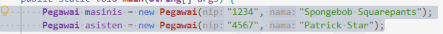

Ada dua object berbeda, satu untuk masinis, satu untuk asisten. Masing-masing variabel (masinis dan asisten) menunjuk ke objek yang berbeda di memori. Constructor KeretaApi menerima dua referensi itu dan menyimpannya ke dua field terpisah (this.masinis, this.asisten).

## Percobaan 4: Array of Object dan Multiplicity (Gerbong, Kursi, dan Penumpang)

Kode:

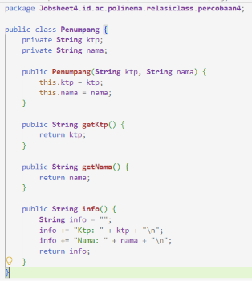
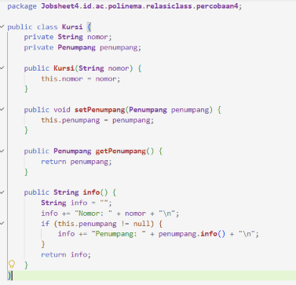
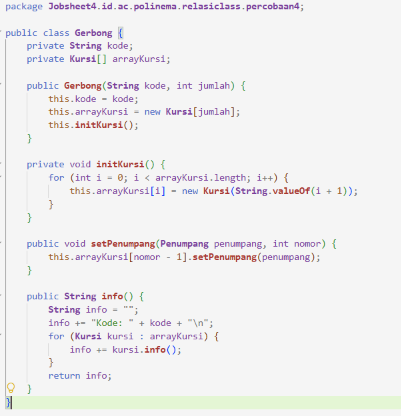
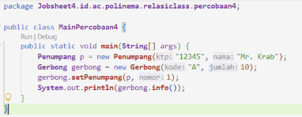

Output:

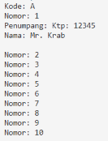

### Pertanyaan

#### 1. Pada main program dalam class MainPercobaan4, berapakah jumlah kursi dalam Gerbong A?

10 Kursi 

#### 2. Perhatikan potongan kode if (this.penumpang != null) { ... } pada method info() dalam class Kursi. Apa maksud kode tersebut? 

Maksudnya: hanya mencetak info penumpang jika kursi sudah terisi, agar tidak terjadi error null pointer. 

#### 3. Mengapa pada method setPenumpang() dalam class Gerbong, nilai nomor dikurangi dengan angka 1? 

Karena indeks array dimulai dari 0, sedangkan nomor kursi dimulai dari 1. Tanpa pengurangan, arrayKursi[1] akan mengakses kursi nomor 2, dan kursi nomor 10 (arrayKursi[10]) akan menyebabkan error karena array hanya punya indeks 0–9. 

#### 4. Instansiasi objek baru budi dengan tipe Penumpang, kemudian masukkan objek baru tersebut pada gerbong dengan gerbong.setPenumpang(budi, 1), menimpa Mr. Krab yang sudah duduk di sana. Apakah yang terjadi? Apakah Java memberi peringatan/error? 

##### Kode:

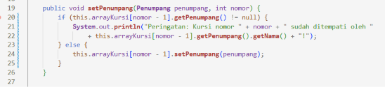
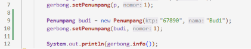

##### Output:

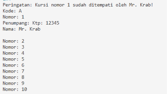

Mr. Krab akan tertimpa (digantikan) oleh Budi. Java tidak memberi peringatan/error apa pun, karena: 
1. setPenumpang(Penumpang penumpang, int nomor) hanya mengeksekusi this.arrayKursi[nomor - 1].setPenumpang(penumpang); 
2. Method Kursi.setPenumpang() hanya menulis this.penumpang = penumpang; menimpa referensi lama tanpa cek. 

#### 5. Modifikasi program sehingga tidak diperkenankan menduduki kursi yang sudah ada penumpang lain (tambahkan pengecekan pada Gerbong.setPenumpang() sebelum baris arrayKursi[nomor - 1].setPenumpang(...) dijalankan).

##### Kode:

##### Output:

#### 6. Bandingkan tiga bentuk relasi has-a yang sudah kita praktikkan: LaptopProcessor (Percobaan 1, 1- 1), KeretaApi-Pegawai (Percobaan 3, dua relasi 11 bernama), dan Gerbong-Kursi (Percobaan 4, 1..*). Untuk kasus seperti apa kita akan memilih array, dan untuk kasus seperti apa kita akan memilih atribut bernama satu-satu?

Pakai array ketika: 
1. Jumlah part tidak tetap (bisa berubah-ubah) atau banyak. 
2. Part tidak punya peran khusus yang berbeda satu sama lain (kursi 1, 2, 3... semuanya kursi). 
3. Part tidak punya nama role yang bermakna (bandingkan dengan "masinis" vs "asisten"). 

Pakai atribut bernama satu-satu ketika: 
1. Jumlah part tetap dan sedikit. 
2. Setiap part punya peran berbeda yang harus dibedakan secara eksplisit (misal masinis vs asisten, keuangan vs pemasaran). 

#### 7. Terapkan kriteria kode (siapa yang memanggil new) pada dua relasi has-a di Percobaan ini: GerbongKursi dan Kursi-Penumpang. Manakah yang Aggregation dan manakah yang Composition? Tunjukkan baris kode yang menjadi bukti untuk masing-masing.

1. Composition: GerbongKursi 

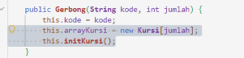
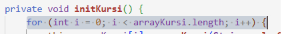

Gerbong sendiri yang memanggil new Kursi(...), dan initKursi() bersifat private, hanya bisa dipanggil dari dalam Gerbong. Tidak ada parameter bertipe Kursi atau Kursi[] di constructor Gerbong. Pemanggil luar (MainPercobaan4) tidak pernah membuat Kursi. 

2. Aggregation: Kursi Penumpang 

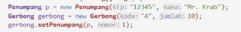
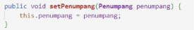

Penumpang dibuat di luar Kursi/Gerbong, lalu di-inject lewat setter. Kursi tidak pernah memanggil new Penumpang(...). Penumpang bisa pindah kursi, bisa berdiri sendiri tanpa kursi (secara konsep). Lifecycle Penumpang tidak terikat pada Kursi.

## Percobaan 5: Composition (Mobil dan Mesin)

##### Kode: 

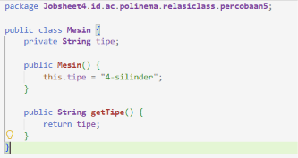
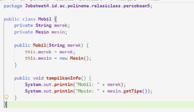
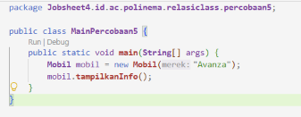

##### Output:

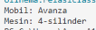

### Pertanyaan

#### 1. Pada class Mobil, baris manakah yang menunjukkan bahwa Mesin adalah bagian yang “dimiliki secara eksklusif” oleh Mobil (bukan sekadar “dipinjam”)?  

Jika ditambah setMesin(), relasi tidak lagi Composition murni, karena objek Mesin dari luar bisa menggantikan Mesin yang ada. Lifecycle Mesin tidak lagi eksklusif milik Mobil. Bisa jadi Aggregation.

#### 2. Apa yang terjadi secara desain jika ditambahkan method setMesin(Mesin mesin) pada class Mobil? Apakah relasi ini akan tetap menjadi Composition? Jelaskan.  

Jika ditambah setMesin(), relasi tidak lagi Composition murni, karena objek Mesin dari luar bisa menggantikan Mesin yang ada. Lifecycle Mesin tidak lagi eksklusif milik Mobil. Bisa jadi Aggregation. 

#### 3. Bandingkan dengan Percobaan 1 (Laptop-Processor): sebutkan satu perbedaan baris kode yang membuat salah satunya Aggregation dan yang lain Composition.

Percobaan 1: Laptop(String merk, Processor proc) menerima Processor dari luar ( Aggregation ).  
Percobaan 5: Mobil(String merek) memanggil new Mesin() di dalam  ( Composition ). 

#### 4. Jika objek mobil di MainPercobaan5 di-set null setelah tampilkanInfo() dipanggil, apa yang terjadi pada objek Mesin miliknya? Bandingkan dengan nasib objek Processor pada Percobaan 1 seandainya objek Laptop-nya dihapus, apakah Processor tersebut masih bisa “diselamatkan” oleh kode lain? Kenapa Mesin tidak bisa? 

Jika mobil di-set null, objek Mesin tidak bisa diakses lagi dan akan di-GC. Pada Percobaan 1, Processor masih bisa diselamatkan jika ada referensi lain (misal variabel p di main). Mesin tidak bisa karena tidak ada referensi lain yang dipegang dari luar.

#### 5. Coba (secara terpisah, boleh di file/package percobaan sendiri) tambahkan constructor kedua pada Mobil yang menerima parameter Mesin, mirip pola Percobaan 1: public Mobil(String merek, Mesin mesin) { this.merek = merek; this.mesin = mesin; }. Kalau constructor ini yang dipakai, apakah MobilMesin berubah menjadi Aggregation? Jelaskan alasannya. 

Jika Mobil memakai constructor Mobil(String merek, Mesin mesin), maka relasi berubah menjadi Aggregation, karena Mesin dibuat di luar dan di-inject. Mobil tidak lagi memanggil new Mesin().

## Percobaan 6: Dependency / Uses-A (Laptop Mencetak Dokumen ke Printer)

##### Kode: 

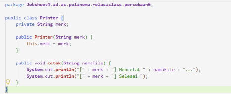
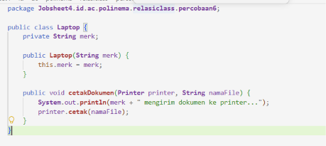
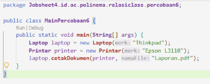

##### Output:

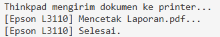

### Pertanyaan

#### 1. Apakah class Laptop pada percobaan ini memiliki atribut bertipe Printer? Bandingkan dengan Percobaan 1, di mana Processor disimpan sebagai atribut Laptop. 

Tidak. Laptop tidak punya atribut Printer. Pada Percobaan 1, Laptop punya atribut proc bertipe Processor. 

#### 2. Setelah method cetakDokumen() selesai dijalankan, apakah Laptop masih menyimpan referensi ke objek printer yang tadi dipakai? Jelaskan berdasarkan baris kode class Laptop.  

Tidak. Printer hanya parameter method. Setelah method selesai, referensi printer tidak disimpan.

#### 3. Mengapa relasi Laptop-Printer pada percobaan ini disebut Dependency (usesa), bukan Aggregation, meskipun sama-sama melibatkan dua objek yang saling berinteraksi?.

Karena Laptop hanya menggunakan Printer sesaat lewat parameter method, tidak menyimpannya sebagai atribut. Aggregation menyimpan part sebagai atribut. 

#### 4. Coba ubah kode Laptop supaya Printer disimpan sebagai atribut (mis. private Printer printerDefault, diisi lewat constructor atau setter, lalu dipakai kembali di cetakDokumen() tanpa parameter Printer). Apakah relasi ini sekarang berubah dari Dependency menjadi Aggregation? Jelaskan. 

##### Kode:

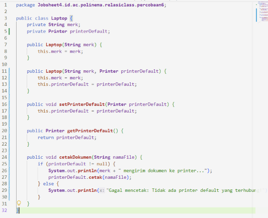
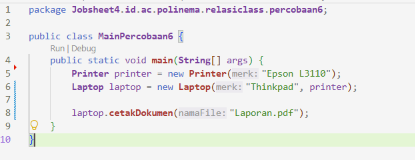

Ya, jika Printer disimpan sebagai atribut dan diisi lewat constructor/setter, relasi berubah menjadi Aggregation, karena Laptop "memiliki" printer default dan bisa memakainya berulang kali. 

#### 5. Lengkapi tabel berikut dengan kata-katamu sendiri (boleh dijawab di laporan): untuk masing-masing dari Aggregation, Composition, dan Dependency, sebutkan (a) apakah objek part disimpan sebagai atribut atau tidak, dan (b) siapa yang memanggil new untuk membuat objek part tersebut.  

1. Aggregation: part disimpan sebagai atribut; new dipanggil di luar class whole (oleh client), lalu di-inject. 
2. Composition: part disimpan sebagai atribut; new dipanggil oleh class whole sendiri. 
3. Dependency: part tidak disimpan sebagai atribut; new dipanggil di luar, objek hanya lewat parameter method. 

## Tugas dan Deliverable

1. Tugas 1

##### Kode: 

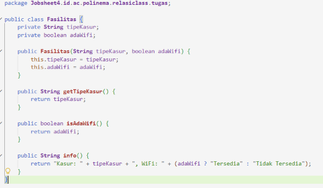
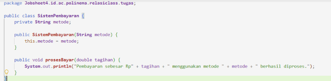
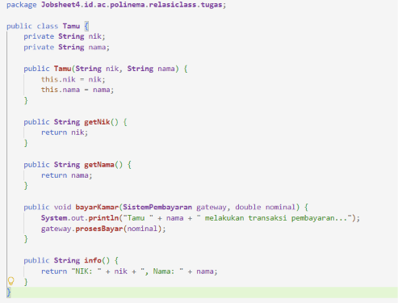
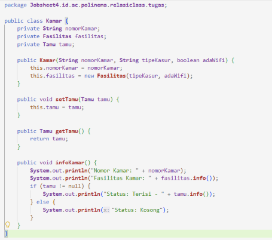
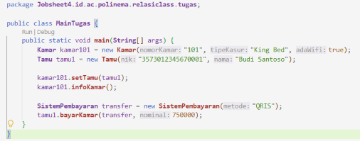

##### Output:

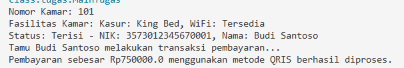

Relasi Composition terdapat pada hubungan antara kelas Kamar dan kelas Fasilitas, dibuktikan pada baris this.fasilitas = new Fasilitas(tipeKasur, adaWifi); di dalam konstruktor kelas Kamar. Fasilitas diciptakan langsung saat kamar diinisialisasi dan tidak menerima objek fasilitas dari luar, sehingga jika objek Kamar musnah dari memori, objek Fasilitas tersebut ikut musnah.   

Relasi Aggregation terdapat pada hubungan antara kelas Kamar dan kelas Tamu, dibuktikan pada atribut private Tamu tamu; serta method public void setTamu(Tamu tamu). Objek Tamu dibuat terlebih dahulu secara independen di luar kelas Kamar (MainTugas) lalu dihubungkan ke kamar melalui method setter, sehingga masa hidup tamu tidak bergantung pada keberadaan kamar.   

Relasi Dependency (uses-a) terdapat pada hubungan antara kelas Tamu dan kelas SistemPembayaran, dibuktikan pada method public void bayarKamar(SistemPembayaran gateway, double nominal). Objek SistemPembayaran hanya hadir sementara sebagai argumen parameter method saat proses transaksi berlangsung, tanpa disimpan sebagai variabel atribut di dalam kelas Tamu.

2. Tugas 2

Dalam menentukan jenis relasi antar kelas, kita mengevaluasi derajat keterikatan kepemilikan dan masa hidup (lifecycle) objek. Pertanyaan kunci yang diajukan ke diri sendiri adalah: apakah bagian (part) tersebut harus ikut hancur jika kelas induknya (whole) dihapus? Jika iya, relasi tersebut harus dirancang sebagai Composition. Jika objek bagian dapat tetap eksis secara mandiri dan digunakan oleh entitas lain meskipun induknya dihapus, relasi tersebut adalah Aggregation. Terakhir, jika suatu kelas hanya meminjam fungsi dari kelas lain sesaat untuk menyelesaikan suatu operasi method tanpa perlu menyimpannya sebagai bagian dari atribut objek, relasi tersebut cukup dirancang sebagai Dependency (uses-a).

