| | Praktikum Pemrograman Berbasis Objek |
|---|---|
| NIM | 254107020065 |
| Nama | Mayla Ayu Kirana Nathaniela |
| Kelas | TI 2G |
| Repository | https://github.com/maylakirana2605-ui/PraktikumPBO|

# Jobsheet Praktikum: Pertemuan 6 Inheritance (Pewarisan) 

<div style="text-align: justify;">

## Percobaan 1: Single Inheritance dengan extends (ClassA dan ClassB) 

Solusi diimplementasikan pada file: 

- [ClassA.java](../percobaan1/ClassA.java)
- [ClassB.java](../percobaan1/ClassB.java)
- [MainPercobaan1.java](../percobaan1/MainPercobaan1.java)

output:  

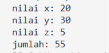

## Pertanyaan Percobaan 1

### 1. Mengapa kompilasi pada Langkah 5 gagal? Tuliskan pesan error pertama beserta file dan baris tempat error muncul. 

Class ClassB belum dideklarasikan sebagai turunan (extends) dari ClassA. Akibatnya, ClassB tidak mengenali atribut x dan y yang digunakan pada method getJumlah(), serta objek hitung pada MainPercobaan1 tidak dapat mengenali atribut x, y, maupun method getNilai().

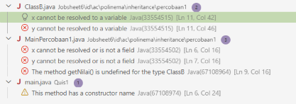


### 2. Baris kode mana yang diubah pada Langkah 6, dan apa artinya? Sebutkan class yang berperan sebagai superclass dan subclass. 

Baris yang diubah: Deklarasi class pada ClassB.java diubah dari public class ClassB menjadi:

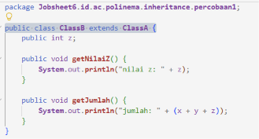

Artinya: Kata kunci extends menyatakan bahwa ClassB melakukan pewarisan (inheritance) dari ClassA, sehingga ClassB secara otomatis mewarisi seluruh atribut dan method publik yang dimiliki oleh ClassA

Peran class:

- Superclass (Parent class): ClassA
- Subclass (Child class): ClassB

### 3. Setelah diperbaiki, sebutkan atribut dan method yang dapat dipakai oleh objek hitung. Kelompokkan mana yang dideklarasikan di ClassA dan mana yang dideklarasikan di ClassB. 

1. Dideklarasikan di ClassA:

- Atribut: x (int), y (int)
- Method: getNilai()

2. Dideklarasikan di ClassB:

- Atribut: z (int)
- Method: getNilaiZ(), getJumlah()

### 4. Pada MainPercobaan1, hitung.x = 20 ditulis pada objek ClassB, padahal atribut x tidak dideklarasikan di ClassB. Mengapa hal ini diperbolehkan? 

Hal ini diperbolehkan karena ClassB mewarisi ClassA (extends ClassA). Melalui mekanisme inheritance, semua member non-private yang ada pada superclass (ClassA) secara otomatis menjadi bagian dari subclass (ClassB). Karena atribut x dideklarasikan dengan modifier public di ClassA, objek dari ClassB dapat mengaksesnya secara langsung layaknya atribut miliknya sendiri.

### 5. Atribut x dan y pada ClassA dibuat public, sehingga dapat diubah langsung dari MainPercobaan1. Apa risiko dari desain seperti ini? (jawaban ini akan kita telusuri pada Percobaan 2) 

1. Pelanggaran enkapsulasi (encapsulation): Data internal class menjadi terbuka bebas tanpa kontrol validasi, sehingga nilainya dapat diubah sembarangan oleh class luar.
2. Risiko inkonsistensi data: Tidak ada mekanisme penyaringan (seperti validasi logika pada setter) untuk memastikan nilai atribut tetap valid sesuai aturan bisnis.
3. Ketergantungan tinggi (tight coupling): Jika struktur atau tipe data atribut x atau y diubah di masa mendatang, seluruh kode luar yang mengaksesnya langsung akan ikut rusak/error.

### 6. Coba tambahkan class ClassD lalu ubah deklarasi menjadi public class ClassB extends ClassA, ClassD. Apa yang terjadi? Apa yang dapat Anda simpulkan tentang jumlah superclass langsung pada Java? 

Terjadi error kompilasi

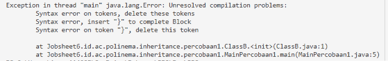

Bahasa pemrograman Java hanya mendukung single inheritance untuk pewarisan class (sebuah class hanya boleh memiliki satu superclass langsung). Java tidak mendukung multiple inheritance langsung menggunakan kata kunci extends lebih dari satu class sekaligus.

## Percobaan 2: Hak Akses pada Pewarisan (private dan protected)

Solusi diimplementasikan pada file: 

- [ClassA.java](../percobaan2/ClassA.java)
- [ClassB.java](../percobaan2/ClassB.java)
- [MainPercobaan2.java](../percobaan2/MainPercobaan2.java)

output:  

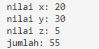

## Pertanyaan Percobaan 2 

### 1. Di file dan baris mana error pada Langkah 5 muncul, dan apa pesannya? Mengapa error tidak muncul di MainPercobaan2? 

erjadi di file ClassB.java pada baris 15 (di dalam method getJumlah()).Karena MainPercobaan2 hanya memanggil method-method yang berstatus public (setX(), setY(), setZ(), getNilai(), getNilaiZ(), dan getJumlah()). MainPercobaan2 sama sekali tidak berusaha mengakses variabel x atau y secara langsung, melainkan lewat perantara method publik.

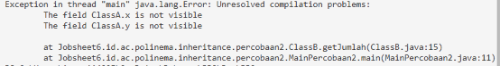

### 2. Jelaskan penyebab error tersebut dengan merujuk pada tabel kontrol pengaksesan (Langkah 1). 

Berdasarkan tabel kontrol pengaksesan:

- Modifier private memiliki hak akses yang sangat terbatas, yaitu hanya dapat diakses oleh class yang sama (ClassA itu sendiri).
- Atribut berstatus private tidak diwariskan ke subclass. Oleh karena itu, meskipun ClassB adalah turunan (subclass) dari ClassA dan berada dalam satu package yang sama, ClassB tetap tidak memiliki izin untuk mengakses variabel x dan y secara langsung.

### 3. Pada kode awal, MainPercobaan2 memanggil hitung.setX(20) dan tidak error, padahal x bersifat private. Mengapa pemanggilan ini diperbolehkan, dan di mana nilai x tersimpan? 

Method setX(int x) dideklarasikan dengan access modifier public di dalam ClassA. Karena public, method ini diwariskan kepada ClassB dan dapat dipanggil bebas oleh class mana pun, termasuk dari MainPercobaan2. Method inilah yang bertindak sebagai antarmuka (interface) resmi untuk mengubah data secara terkontrol. Dan Nilai x tetap tersimpan di dalam memori internal objek hitung (pada bagian memori yang dialokasikan untuk atribut warisan dari ClassA).
### 4. Bandingkan Perbaikan A (protected) dan Perbaikan B (private + getter) dari sisi encapsulation. Mana yang Anda pilih untuk program sungguhan? Jelaskan alasannya. 

Perbandingan:

1. Perbaikan A (protected): Enkapsulasinya lebih longgar karena atribut dapat dimanipulasi secara langsung oleh subclass (bahkan oleh seluruh class lain yang berada dalam package yang sama). Jika subclass salah memberi nilai, tidak ada filter logika/validasi yang menahannya.
2. Perbaikan B (private + getter): Menerapkan enkapsulasi yang kuat dan ketat (strict encapsulation). Atribut benar-benar terisolasi dari dunia luar, dan pembacaan/perubahan data hanya dapat dilakukan melalui method (getX() / setX()).

Pilihan untuk program sungguhan: Perbaikan B (private + getter/setter). Karena menjaga integritas data (data integrity) dan loose coupling. Kita bebas menambahkan validasi logika pada setter/getter tanpa khawatir kode di subclass rusak, serta menghindari class lain mengubah atribut penting secara tidak sengaja.

### 5. Andaikan ClassA dan ClassB berada di package yang berbeda. Berdasarkan tabel, apakah ClassB tetap dapat mengakses atribut protected milik ClassA? Bagaimana jika atributnya default (tanpa modifier)? 

- Jika protected: Ya, ClassB tetap dapat mengaksesnya. Modifier protected memberikan izin akses khusus kepada subclass, meskipun subclass tersebut berada di package yang berbeda.
- Jika default (tanpa modifier): Tidak bisa diakses. Modifier default (package-private) hanya mengizinkan pengaksesan oleh class-class yang berada dalam package yang sama; akses akan tertutup bagi class di luar package meskipun class tersebut adalah subclass-nya

## Percobaan 3: Kata Kunci this dan super (Bangun dan Tabung) 

Solusi diimplementasikan pada file: 

- [Bangun.java](../percobaan3/Bangun.java)
- [Tabung.java](../percobaan3/Tabung.java)
- [MainPercobaan3.java](../percobaan3/MainPercobaan3.java)

output:  

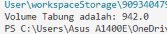

## Pertanyaan Percobaan 3

### 1. Jelaskan fungsi super pada super.phi = phi; dan super.r = r; di method setSuperPhi() dan setSuperR() milik Tabung.

Kata kunci super berfungsi untuk merujuk secara eksplisit ke atribut milik superclass (Bangun), memastikan nilai parameter dimasukkan ke variabel instans phi dan r yang diwarisi dari Bangun.

### 2. Jelaskan fungsi super dan this pada ekspresi super.phi * super.r * super.r * this.t di method volume().
 dan super.r: Mengakses atribut phi dan jari-jari r yang dideklarasikan pada superclass (Bangun).

* this.t: Mengakses atribut tinggi t yang dideklarasikan secara lokal di class itu sendiri (Tabung).

### 3. Mengapa Tabung tidak mendeklarasikan atribut phi dan r, tetapi tetap dapat mengaksesnya? Apa yang terjadi bila pada Bangun keduanya diubah menjadi private?

Tabung dapat mengaksesnya karena mewarisi atribut tersebut dari Bangun yang menggunakan access modifier protected. Jika diubah menjadi private, Tabung`tidak akan bisa mengakses atribut tersebut secara langsung dan memicu error kompilasi.

### 4. Pada Eksperimen 1, apakah output berubah ketika super.phi diganti this.phi? Jelaskan mengapa.

Output tidak berubah (tetap 942.0). Hal ini terjadi karena Tabung tidak mendefinisikan atribut phi tersendiri, sehingga this.phi secara otomatis merujuk ke atribut warisan phi milik superclass.

### 5. Pada Eksperimen 2, mengapa r, this.r, dan super.r menghasilkan nilai yang berbeda? Pada kondisi apa awalan super. menjadi wajib dipakai?

Nilai berbeda terjadi karena adanya fenomena variable shadowing: atribut r pada Tabung menutupi atribut r milik Bangun.

* r dan this.r  merujuk ke variabel lokal milik Tabung yang bernilai 5.
* super.r merujuk ke atribut r milik Bangun yang bernilai 10.

Awalan super. wajib digunakan saat terjadi shadowing, yaitu ketika subclass mendefinisikan nama atribut atau method yang sama persis dengan superclass.

## Percobaan 4: Konstruktor dan Multilevel Inheritance (ClassA, ClassB,ClassC)

Solusi diimplementasikan pada file: 

- [ClassA.java](../percobaan4/ClassA.java)
- [ClassB.java](../percobaan4/ClassB.java)
- [ClassC.java](../percobaan4/ClassC.java)
- [MainPercobaan2.java](../percobaan4/MainPercobaan4.java)

output:  

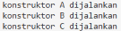

## Pertanyaan Percobaan 4

### 1. Sebutkan class yang berperan sebagai superclass dan subclass pada percobaan ini beserta alasannya. Mengapa ClassB disebut berperan ganda?

ClassA berperan sebagai superclass utama, ClassB berperan sebagai subclass dari ClassA sekaligus superclass bagi ClassC, dan ClassC berperan sebagai subclass dari ClassB. ClassB disebut berperan ganda karena berada di posisi tengah rantai hierarki pewarisan bertingkat (multilevel inheritance), di mana ClassB mewarisi sifat dari ClassA dan juga diturunkan ke ClassC.

### 2. Program hanya membuat satu objek (new ClassC()), tetapi tiga baris tercetak. Jelaskan mengapa konstruktor ClassA dan ClassB ikut dijalankan.

Ketika objek dari subclass dibuat, Java secara otomatis mengeksekusi konstruktor superclass teratas terlebih dahulu secara berurutan (ClassA, lalu ClassB, hingga ClassC). Hal ini terjadi untuk memastikan bahwa seluruh komponen warisan milik kelas induk terinisialisasi lebih dahulu sebelum kelas anak mengeksekusi konstruktor miliknya.

### 3. Pada Modifikasi 1, mengapa output tidak berbeda dari sebelumnya meskipun super(); ditambahkan secara eksplisit?

Output tidak berbeda karena jika penulisan super(); tidak dituliskan secara eksplisit, compiler Java secara implisit tetap menyisipkan perintah super(); tanpa argumen di baris paling awal dari konstruktor subclass.

### 4. Pada Modifikasi 2 terjadi error. Aturan apa yang dilanggar, dan mengapa Java menetapkan aturan tersebut?

Aturan yang dilanggar adalah pemanggilan konstruktor superclass dengan super() wajib diletakkan pada baris pertama di dalam konstruktor subclass. Java menetapkan aturan ini agar bagian induk dari objek sudah terinisialisasi secara sempurna sebelum kelas anak menjalankan perintah kodenya sendiri.

### 5. Tuliskan urutan proses (bernomor) yang terjadi ketika new ClassC() dieksekusi, dimulai dari pemanggilan konstruktor ClassC hingga seluruh output tercetak.

1. new ClassC() dipanggil pada method main.
2. Konstruktor ClassC() mulai dijalankan dan memanggil super() secara implisit mengarah ke ClassB().
3. Konstruktor ClassB() mulai dijalankan dan memanggil super() secara implisit mengarah ke ClassA().
4. Konstruktor ClassA() dieksekusi penuh, mencetak konstruktor A dijalankan, lalu selesai.
5. Eksekusi kembali ke konstruktor ClassB(), mencetak konstruktor B dijalankan, lalu selesai.
6. Eksekusi kembali ke konstruktor ClassC(), mencetak konstruktor C dijalankan, lalu selesai.

## Percobaan 5: Konstruktor Berparameter dan Overriding (Komputer, Desktop, Laptop)

Solusi diimplementasikan pada file: 

- [Komputer.java](../percobaan5/Komputer.java)
- [Dekstop.java](../percobaan5/Dekstop.java)
- [Laptop.java](../percobaan5/Laptop.java)
- [MainPercobaan5.java](../percobaan5/MainPercobaan5.java)

output:  

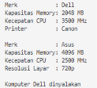

Output Eksperimen 2B:

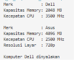

## Pertanyaan Percobaan 5

### 1. Jelaskan fungsi super(merk, memory, cpu) pada konstruktor Desktop. Atribut apa saja yang diisi oleh baris tersebut, dan atribut apa yang diisi oleh baris berikutnya?

Fungsi super(merk, memory, cpu) adalah untuk memanggil konstruktor berparameter milik superclass (Komputer). Baris tersebut menginisialisasi atribut warisan yaitu merk, kapasitasMemory, dan kecepatanCPU. Baris berikutnya (this.printer = printer;) menginisialisasi atribut spesifik milik class Desktop yaitu printer.

### 2. Pada Eksperimen 1, mengapa error muncul di sini, padahal pada Percobaan 4 super() juga tidak ditulis tetapi program tetap berjalan?

Error muncul karena class Komputer tidak memiliki konstruktor default tanpa parameter. Jika super(...) tidak ditulis secara eksplisit, compiler Java akan menyisipkan super() tanpa argumen secara otomatis, namun pemanggilan ini gagal karena Komputer hanya menyediakan konstruktor berparameter. Pada Percobaan 4 program dapat berjalan karena superclass-nya memang memiliki konstruktor default tanpa parameter.

### 3. Method showInfo() ditulis di Komputer sekaligus di Desktop. Apa istilah untuk kondisi ini? Apa yang tercetak bila baris super.showInfo(); pada Desktop dihapus?

Istilah untuk kondisi ini adalah Method Overriding. Jika baris super.showInfo(); pada Desktop dihapus, maka informasi dasar seperti Merk, Kapasitas Memory, dan Kecepatan CPU tidak akan dicetak, dan program hanya akan mencetak baris atribut Printer.

### 4. Pada Eksperimen 2, jelaskan perbedaan hasil kompilasi dengan dan tanpa @Override. Apa manfaat menuliskan @Override?

Dengan anotasi @Override, compiler langsung mendeteksi kesalahan kompilasi karena method showinfo() (huruf i kecil) tidak cocok dengan method showInfo() pada superclass. Tanpa @Override, kompilasi berhasil dilakukan namun Java menganggap showinfo() sebagai method baru biasa, sehingga proses overriding gagal. Manfaat menuliskan @Override adalah sebagai proteksi/validasi saat kompilasi agar terhindar dari kesalahan penulisan nama method.

### 5. Tantangan. Buat class Workstation sebagai turunan Desktop dengan atribut gpu (String). Class ini harus menimpa showInfo() sehingga menampilkan seluruh informasi Desktop ditambah baris GPU. Ketika new Workstation(...) dibuat, konstruktor class apa saja yang terpanggil, dan dalam urutan apa?

```java
package Jobsheet6.id.ac.polinema.inheritance.percobaan5;

public class Workstation extends Desktop {
    protected String gpu;

    public Workstation(String merk, int memory, int cpu, String printer, String gpu) {
        super(merk, memory, cpu, printer);
        this.gpu = gpu;
    }

    @Override
    public void showInfo() {
        super.showInfo();
        System.out.println("GPU             : " + gpu);
    }
}

```

Ketika new Workstation(...) dieksekusi, konstruktor yang dipanggil secara berurutan adalah:

1. Komputer
2. Desktop
3. Workstation

## Tugas 1

Solusi diimplementasikan pada file: 

- [Pegawai.java](../tugas1/Pegawai.java)
- [Dosen.java](../tugas1/Dosen.java)
- [DaftarGaji.java](../tugas1/DaftarGaji.java)
- [MainTugas1.java](../tugas1/MainTugas1.java)

output:  

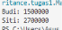


## Pertanyaan Analisis Tugas 1

### (a) Array Pegawai[] dapat menampung objek Dosen. Mengapa hal itu diperbolehkan?

Array Pegawai[] dapat menampung objek Dosen karena Dosen merupakan subclass yang diturunkan dari superclass Pegawai (memiliki hubungan pewarisan is-a). Dalam pemrograman berorientasi objek (OOP), konsep polimorfisme mengizinkan variabel referensi bertipe superclass untuk menampung objek dari subclass turunannya.

### (b) Ketika printSemuaGaji() memanggil getGaji() pada objek Dosen, versi method milik class mana yang dijalankan?

Versi method yang dijalankan adalah milik class Dosen, karena terjadi proses dynamic method dispatch (overriding). Java secara otomatis akan mengeksekusi method getGaji() milik class Dosen yang sudah menimpa (@Override) method milik superclass Pegawai saat runtime.

## Tugas 2

Solusi diimplementasikan pada file: 

- [Televisi.java](../tugas2/Televisi.java)
- [TelevisiModern.java](../tugas2/TelevisiModern.java)
- [MainTugas2.java](../tugas2/MainTugas2.java)

output:  

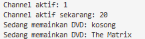

## Pertanyaan Uji Tambahan Tugas 2

### Uji dengan tv.pindahChannel(150), bagaimanakah hasilnya dan mengapa channelAktif tidak dapat diubah langsung dari MainTugas2?

Hasilnya adalah channel aktif tetap bernilai 20 dan tidak berubah menjadi 150. Hal ini disebabkan oleh adanya logika validasi pada method pindahChannel() yang membatasi perubahan channel hanya jika nilainya berada pada rentang 1 sampai jumlahChannel (100).

Atribut channelAktif tidak dapat diubah secara langsung dari MainTugas2 karena diberi access modifier private pada class Televisi. Pembatasan ini bertujuan untuk menjaga prinsip enkapsulasi (encapsulation), sehingga atribut private hanya dapat diakses atau diubah fungsinya melalui method setter/getter resmi yang disediakan.

## Tugas 3

Solusi diimplementasikan pada file: 

- [Character.java](../pengayaan/Character.java)
- [Angel.java](../pengayaan/Angel.java)
- [Human.java](../pengayaan/Human.java)
- [Wizard.java](../pengayaan/Wizard.java)
- [MainTugas3.java](../pengayaan/MainTugas2.java)

output:  

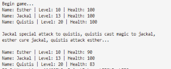

## Pertanyaan Tugas 4

### 1. Jelaskan dengan bahasa Anda sendiri perbedaan hubungan is-a (inheritance) dan has-a (aggregation/composition), lalu beri satu contoh masing-masing dari jobsheet ini.

Hubungan is-a (inheritance) adalah hubungan pewarisan di mana suatu class turunan merupakan bentuk spesifik dari class induknya. Contoh dari jobsheet ini: Dosen is-a Pegawai (Dosen adalah seorang Pegawai).

Hubungan has-a (aggregation/composition) adalah hubungan kepemilikan di mana suatu class memiliki objek dari class lain sebagai bagian dari atributnya. Contoh dari jobsheet ini: DaftarGaji has-a Pegawai (DaftarGaji memiliki/menampung kumpulan objek Pegawai).

### 2. Ringkas aturan pewarisan untuk tiga hal berikut dalam 3-5 kalimat: member private, member protected, dan konstruktor.

Member private tidak diwariskan ke subclass dan tidak dapat diakses secara langsung dari luar class deklarasinya. Member protected dapat diwariskan dan diakses langsung oleh subclass meskipun berada di package yang berbeda. Konstruktor tidak pernah diwariskan ke subclass, namun konstruktor superclass selalu dieksekusi terlebih dahulu menggunakan kata kunci super() sebelum konstruktor subclass dijalankan.

<div style="text-align: justify;">