| | Praktikum Pemrograman Berbasis Objek |
|---|---|
| NIM | 254107020065 |
| Nama | Mayla Ayu Kirana Nathaniela |
| Kelas | TI 2G |
| Repository | https://github.com/maylakirana2605-ui/PraktikumPBO|

# JOBSHEET 2 - KELAS DAN OBJEK

## Langkah 2 - Kelas Rectangle Minimal dan Objek Pertama

Solusi diimplementasikan pada file [Rectangle.java](oop-praktikum/src/id/ac/polinema/Rectangle.java) dan [Main.java](oop-praktikum/src/id/ac/polinema/Main.java), berikut adalah hasil tangkapan hasil program:

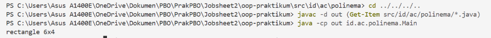

Screenshot Kode Program

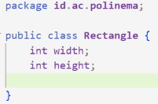
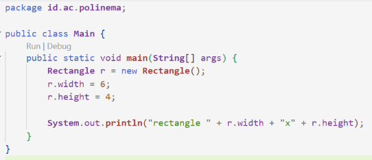

## Langkah 3: Menambahkan Method 

Solusi diimplementasikan pada file [Rectangle.java](oop-praktikum/src/id/ac/polinema/Rectangle.java) dan [Main.java](oop-praktikum/src/id/ac/polinema/Main.java), berikut adalah hasil tangkapan hasil program:

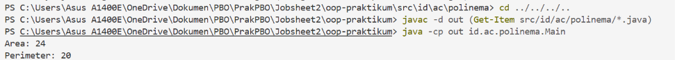

Screenshot Kode Program

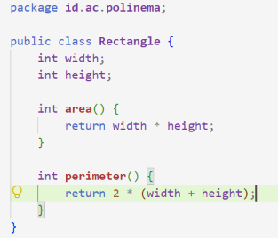
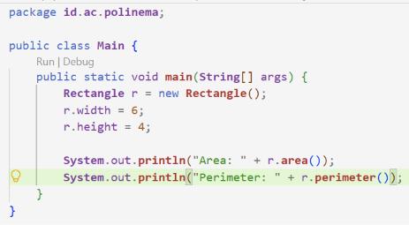

## Langkah 4: Konstruktor dan this

Solusi diimplementasikan pada file [Rectangle.java](oop-praktikum/src/id/ac/polinema/Rectangle.java) dan [Main.java](oop-praktikum/src/id/ac/polinema/Main.java), berikut adalah hasil tangkapan hasil program:

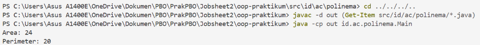

Screenshot Kode Program

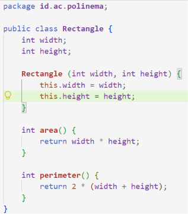
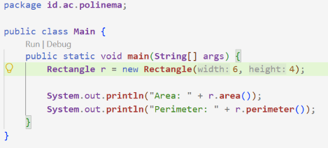

## langkah 5: Referensi, aliasing, dan null

berikut adalah hasil tangkapan hasil program:

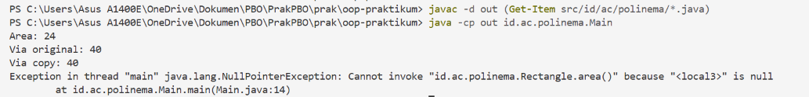

Screenshot Kode Program

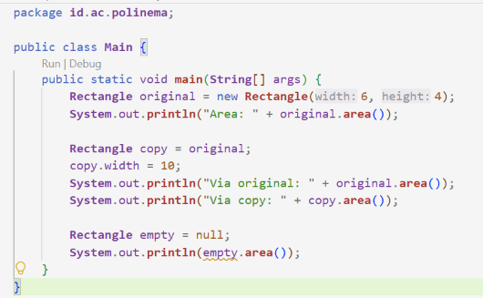

## langkah  6: Kelas Student dari diagram UML

berikut adalah hasil tangkapan hasil program:

Screenshot Kode Program

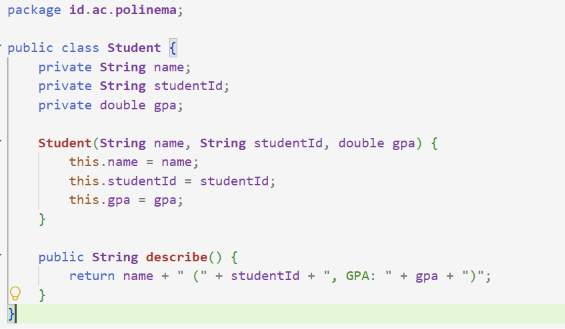
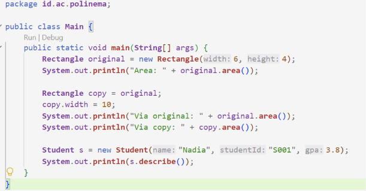

## langkah  7:  Array of objects, banyak objek dari satu kelas

berikut adalah hasil tangkapan hasil program:

Screenshot Kode Program

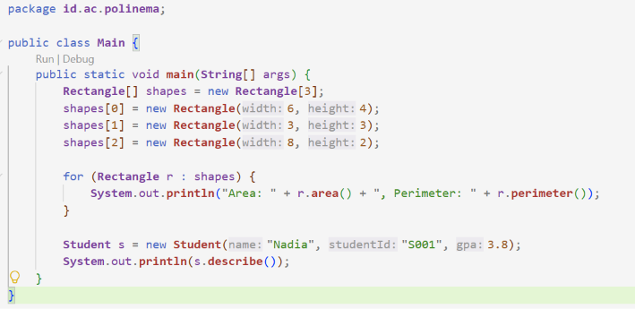

## Tugas Mandiri

### 1. Implementasi Kelas Circle
Solusi diimplementasikan pada file [Circle.java](oop-praktikum/src/id/ac/polinema/Circle.java) dan diuji pada [Main.java](oop-praktikum/src/id/ac/polinema/Main.java). Berikut tangkapan layar hasil program:

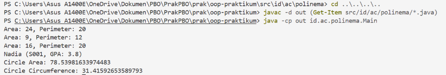

### 2. Jawaban Pertanyaan Konsep
1. **Perbedaan objek dan referensi ke objek:** Objek adalah wujud fisik data yang dialokasikan di dalam memori Heap, sedangkan referensi ke objek adalah variabel di Stack yang memegang alamat memori tempat objek tersebut berada.
2. **Kapan konstruktor dijalankan:** Konstruktor dijalankan secara otomatis tepat saat kata kunci `new` dipanggil untuk menginisialisasi atribut objek yang baru dibuat.